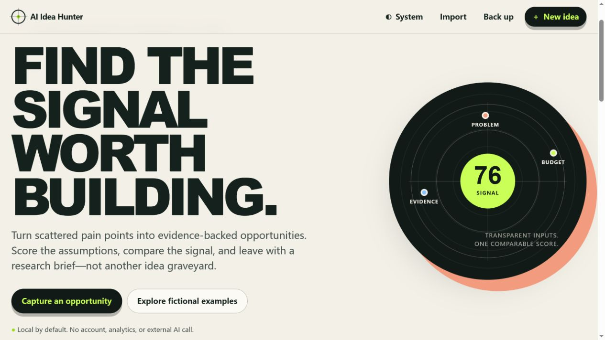

# AI Idea Hunter

[](https://github.com/xuanbui79zombie-svg/AI-Idea-Hunter/actions/workflows/quality.yml)
[](https://github.com/xuanbui79zombie-svg/AI-Idea-Hunter/actions/workflows/pages.yml)
[](LICENSE)

AI Idea Hunter is a local-first opportunity workspace for independent developers. It turns scattered observations into evidence-backed AI software ideas that can be scored transparently, compared consistently, and exported as research briefs.

> Status / 状态: `v1.1.2` Hero layout fix released / `v1.1.2` 首页布局修复已发布. English and Simplified Chinese Hero copy now remains readable at desktop and narrow viewports / 中英文首页文案现可在桌面与窄屏视口正常显示. Candidates remain provisional; real-user validation remains opt-in / 候选结果仍仅供参考；真实用户验证仍为按需启用.

**[Open the live demo](https://xuanbui79zombie-svg.github.io/AI-Idea-Hunter/)**



## Why It Exists

Idea backlogs often mix assumed problems with proposed features and rank them by excitement. AI Idea Hunter asks for the problem, audience, evidence, uncertainty, and next validation step before a project earns attention.

The resulting score organizes work; it does not claim market demand, revenue, or product-market fit.

## Features

- Create, edit, archive, and safely delete structured opportunities.
- Attach dated evidence notes with explicit signal strength.
- Score seven visible factors with a documented weighted formula.
- Search, filter, sort, and inspect dashboard signals.
- Export a single idea as a Markdown research brief.
- Back up and restore the full workspace as versioned JSON.
- Load clearly labelled fictional examples on demand.
- Use system, light, or dark themes on desktop and mobile.
- Switch the complete interface, fictional examples, AI-generated candidate content, system messages, and research-brief exports between English and Simplified Chinese with a locally persisted preference.
- Review a daily, source-linked candidate feed collected from approved public Hacker News and GitHub APIs.
- Inspect AI reasoning, uncertainty, freshness, source coverage, and provisional factor scores before saving a candidate.
- Keep working when a source or model is unavailable through explicit degraded and deterministic fallback states.
- Work without an account, server, analytics tracker, or model API key.

## Quick Start

Requirements: [Node.js 24 LTS](https://nodejs.org/en/about/previous-releases).

```bash
npm install
npm run dev
```

Open `http://127.0.0.1:4173`.

Use the `中文` / `EN` control in the header to change the interface language. AI-generated candidates switch between validated English and Simplified Chinese fields; original source quotations and user-entered content are never silently translated or transmitted.

There are no production or development packages; `npm install` verifies metadata and the lockfile. Any static HTTP server can serve `src/`.

## Quality Commands

```bash
npm run check
npm test
npm run test:all
```

The current suite covers workspace and discovery-feed validation, source normalization, prompt boundaries, fallback analysis, weighted scoring, storage failure and recovery, JSON round-trip, import rejection, portable filenames, and Markdown output.

## How the Score Works

| Factor | Weight |
| --- | ---: |
| Pain severity | 20% |
| Frequency | 15% |
| Willingness to pay | 15% |
| Reach | 10% |
| Feasibility | 15% |
| Differentiation | 10% |
| Evidence confidence | 15% |

Each input uses a 1–5 scale. The normalized score is `round(sum(value × weight) / 5 × 100)`, producing a result from 20 to 100. Every input and contribution remains visible.

## Privacy and Recovery

Workspace content stays in browser localStorage unless the user explicitly downloads a JSON or Markdown file. The browser requests only the same-origin public candidate feed; it never sends workspace content to collectors or models. The application loads no third-party script or font and contains no analytics.

Public collection and GitHub Models analysis run in GitHub Actions with an ephemeral workflow token. The deployed feed contains public-source excerpts and links only; no browser API key or repository secret is exposed.

Browser clearing or private-browsing behavior can remove data. Export JSON backups regularly. Invalid imports do not mutate the active workspace, and malformed stored data opens a safe empty workspace with a visible warning.

## Project Structure

```text
src/
├── index.html       # semantic application shell
├── styles.css       # responsive design system and themes
├── data/            # generated, same-origin public candidate feed
└── js/
    ├── app.js       # composition and user-intent orchestration
    ├── ui.js        # safe DOM rendering and interaction
    ├── model.js     # entities, validation, limits, examples
    ├── scoring.js   # pure transparent scoring
    ├── storage.js   # localStorage adapter and recovery
    ├── export.js    # JSON and localized Markdown boundaries
    ├── discovery.js # candidate-feed validation and local conversion
    └── i18n.js      # English and Simplified Chinese resources
tests/               # Node built-in test suite
scripts/             # checks, local server, and discovery collector
docs/                # product, architecture, schema, contracts, ADRs
```

## Documentation

- [Product requirements](docs/PRODUCT.md)
- [Architecture](docs/ARCHITECTURE.md)
- [Data model](docs/DATABASE.md)
- [Module contracts](docs/API.md)
- [ADR-0001: local-first native web](docs/adr/0001-local-first-native-web.md)
- [ADR-0002: build-time automated discovery](docs/adr/0002-build-time-automated-discovery.md)
- [Delivery tasks](TASKS.md)
- [Technology choices](TECH_STACK.md)
- [Release test report](docs/TEST_REPORT.md)
- [Release checklist](docs/RELEASE_CHECKLIST.md)
- [Portfolio and interview review](docs/PORTFOLIO_REVIEW.md)
- [Inactive optional M7 usability plan / 未启用的可选 M7 可用性计划](docs/research/USABILITY_TEST_PLAN.md)
- [Inactive optional recruitment brief / 未启用的可选招募说明](docs/research/RECRUITMENT_BRIEF.md)
- [Inactive optional session template / 未启用的可选会话模板](docs/research/SESSION_TEMPLATE.md)
- [M7 skip decision and evidence log / M7 跳过决定与证据日志](docs/research/VALIDATION_LOG.md)
- [Security policy](SECURITY.md)

## Contributing

Read [CONTRIBUTING.md](CONTRIBUTING.md), [PROJECT_RULES.md](PROJECT_RULES.md), and [AGENTS.md](AGENTS.md). Report vulnerabilities privately according to [SECURITY.md](SECURITY.md).

## License

Licensed under the [MIT License](LICENSE).
